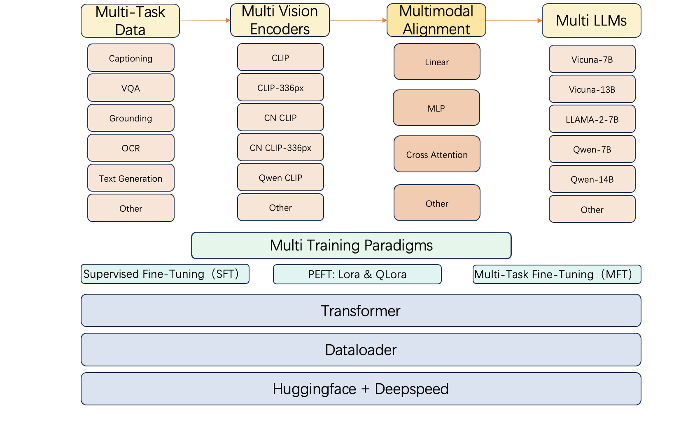
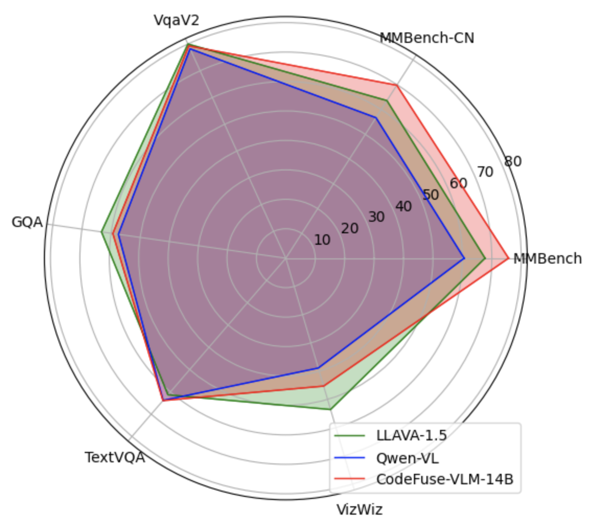

## CodeFuse-VLM
CodeFuse-VLM is a Multimodal LLM(MLLM) framework that provides users with multiple vision encoders, multimodal alignment adapters, and LLMs. Through CodeFuse-VLM framework, users are able to customize their own MLLM model to adapt their own tasks.
As more and more models are published on Huggingface community, there will be more open-source vision encoders and LLMs. Each of these models has their own specialties, e.g. Code-LLama is good at code-related tasks but has poor performance for Chinese tasks. Therefore, we built CodeFuse-VLM framework to support multiple vision encoders, multimodal alignment adapters, and LLMs to adapt different types of tasks.

Under CodeFuse-VLM framework, we use cross attention multimodal adapter, Qwen-14B LLM, and Qwen-VL's vision encoder to train CodeFuse-VLM-14B model. On multiple benchmarks, our CodeFuse-VLM-14B shows superior performances over Qwen-VL and LLAVA-1.5.

Here is the table for different MLLM model's performance on benchmarks
Model | MMBench | MMBench-CN | VqaV2 | GQA | TextVQA | Vizwiz
| ------------- | ------------- | ------------- | ------------- | ------------- | ------------- | ------------- |
LLAVA-1.5 | 67.7 | 63.6 | 80.0 | 63.3 | 61.3 | 53.6
Qwen-VL | 60.6 | 56.7 | 78.2 | 57.5 | 63.8 | 38.9 
CodeFuse-VLM-14B | 75.7 | 69.8 | 79.3 | 59.4 | 63.9 | 45.3

## Contents
- [Install](#Install)
- [Datasets](#Datasets)
- [Multimodal Alignment](#Multimodal-Alignment)
- [Visual Instruction Tuning](#Visual-Instruction-Tuning)
- [Evaluation](#Evaluation)

## Install
Please run sh init\_env.sh 

## Datasets
Here's the table of datasets we used to train CodeFuse-VLM-14B:

Dataset | Task Type | Number of Samples 
| ------------- | ------------- | ------------- |
synthdog-en | OCR | 800,000
synthdog-zh	| OCR | 800,000
cc3m(downsampled)| Image Caption | 600,000
cc3m(downsampled)| Image Caption | 600,000
SBU | Image Caption | 850,000
Visual Genome VQA (Downsampled) | Visual Question Answer(VQA) | 500,000
Visual Genome Region descriptions (Downsampled) | Reference Grouding | 500,000
Visual Genome objects (Downsampled) | Grounded Caption | 500,000
OCR VQA (Downsampled) | OCR and VQA | 500,000

Please download these datasets on their own official websites.

## Multimodal Alignment
Please run sh scripts/pretrain.sh or sh scripts/pretrain\_multinode.sh

## Visual Instruction Tuning
Please run sh scripts/finetune.sh or sh scripts/finetune\_multinode.sh

## Evaluation
Please run python scrips in directory llava/eval/

## Video Demo

https://private-user-images.githubusercontent.com/22836551/300386230-8e64f615-ac0e-447e-9695-c96b254d484f.mp4?jwt=eyJhbGciOiJIUzI1NiIsInR5cCI6IkpXVCJ9.eyJpc3MiOiJnaXRodWIuY29tIiwiYXVkIjoicmF3LmdpdGh1YnVzZXJjb250ZW50LmNvbSIsImtleSI6ImtleTUiLCJleHAiOjE3MDY1MjExODksIm5iZiI6MTcwNjUyMDg4OSwicGF0aCI6Ii8yMjgzNjU1MS8zMDAzODYyMzAtOGU2NGY2MTUtYWMwZS00NDdlLTk2OTUtYzk2YjI1NGQ0ODRmLm1wND9YLUFtei1BbGdvcml0aG09QVdTNC1ITUFDLVNIQTI1NiZYLUFtei1DcmVkZW50aWFsPUFLSUFWQ09EWUxTQTUzUFFLNFpBJTJGMjAyNDAxMjklMkZ1cy1lYXN0LTElMkZzMyUyRmF3czRfcmVxdWVzdCZYLUFtei1EYXRlPTIwMjQwMTI5VDA5MzQ0OVomWC1BbXotRXhwaXJlcz0zMDAmWC1BbXotU2lnbmF0dXJlPWQ5NzNjM2U1ZWU4NDU0Yzc5NmE4ZTM1NzY2ZjU4YjRjY2ZhNjMzODk0ZDgzMDg4N2FjYjZhYTllM2E3NTAyMWQmWC1BbXotU2lnbmVkSGVhZGVycz1ob3N0JmFjdG9yX2lkPTAma2V5X2lkPTAmcmVwb19pZD0wIn0.pr-ad7rKYBgk26DTItj2q2q9I5dRWnBNHbV9M7GSVCo
